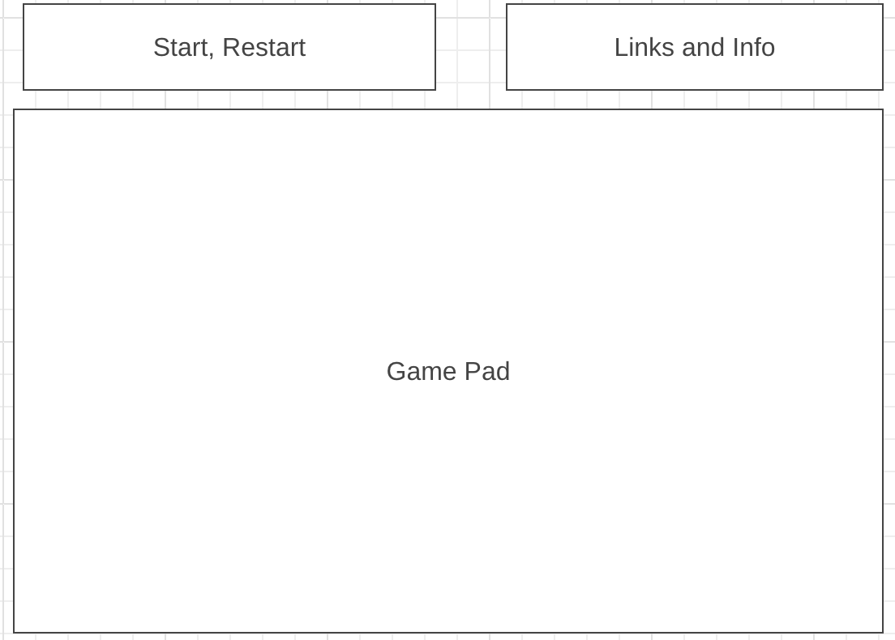

Background:
    MiisyleTank is going to be a game where two or more players take turns to shoot projectiles based on how much force is applied by pressing space. when missle collides the platforms it would have a damage radius and damage the tanks.

    Players will also be able to move around the map to reposition themselves, may also take in a factor of wind that changes every round randomly and it would affect on missles that is in the air

Technologies, Libraries and APIs
    Don't know what libraries or APIs I'm going to use. I will update this README when I encounter situations where I'm going to need APIs/Libraries etc.

WireFrames
    

Functionalities:
    In MiisyleTank, users will be able to:
        * Start, Pause, and Restart
        * move current player's tank on a 2d platform
        * Shoot missle projectiles to damage other players
        * Visualize where the missle have hit and it's damage radius
    In addition, this project will include:
        * Instructions for basic controls and how to win a game
        * A production README
    
Implementation Timeline
    Friday/Weekend: Set up the basic canvas and create class for tank and game class as well as the background platform that tanks are going to be move on

    Monday: Add movements to tanks and restrictions on how far a tank can move and time, and create missle class

    Tuesday: Implement game logic

    Wednesday: If finish game logic then make my game look cleaner and prettier using sprites

    Thursday: Refactor what is left off and if everything basic is finished will then think about remodel my tank, map, and background